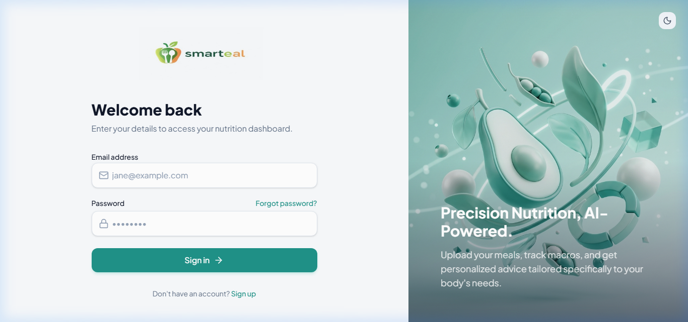

# 🥗 Smarteal - AI-Powered Nutrition & Health Companion

> **Graduation Project** | A comprehensive full-stack application leveraging Computer Vision (YOLOv8 + Gemini Vision) and Retrieval-Augmented Generation (RAG) to revolutionize daily nutritional tracking, personalized meal recommendations, and weight management.

---


---

## 📸 Application Screenshots

| 🔐 Sign In & Authentication | 📊 Interactive Health Dashboard |
| :-------------------------: | :-----------------------------: |
|  |  |


---

## 🌟 Key Features

### 1. 🔑 Smart Authentication & User Profile
- **Secure Access:** Email/password authentication integrated with Supabase/PostgreSQL.
- **Scientific Goal Setting:** Automatic calculation of **BMR** (Basal Metabolic Rate) and **TDEE** (Total Daily Energy Expenditure) using the **Mifflin-St Jeor** formula based on user metrics (age, gender, weight, height, activity level).

### 2. 📊 Interactive Dashboard & Tracking
- **Real-Time Calorie & Macro Gauges:** Track daily intake for Calories, Protein, Carbohydrates, and Fats.
- **Water Consumption Tracker:** Quick-log water intake with goal progress indicators.
- **Weight Projection & Analytics:** Visual charts (powered by **Recharts**) mapping historical weight data and future projections.

### 3. 📸 AI Food Scanner (Computer Vision)
- **Object Detection (YOLOv8):** Detects food items in real-time within uploaded or captured food photos.
- **Nutritional Analysis (Google Gemini Vision):** Estimates portion size and calculates caloric & macronutrient breakdowns per 100g.

### 4. 🤖 RAG-Powered AI Health Coach (NLP)
- **Context-Aware Assistance:** Built with **Retrieval-Augmented Generation (RAG)**.
- **Personalized Recommendations:** Combines user profile, dietary preferences, weight history, and logged meals to output customized nutrition advice.

### 5. 🔔 Automated Notification Engine
- **Proactive Alerts:** Dynamic backend notification engine that monitors daily goals and sends timely hydration & meal logging reminders.

---

## 🏗️ System Architecture

```
NutritionProject/
├── backend_api/        # FastAPI Application & API Route Controllers
│   └── api.py          # Entry point for HTTP routes (/api/...)
├── business_logic/     # Core Algorithms & Business Logic
│   ├── nutrition_logic.py  # BMR/TDEE math & Mifflin-St Jeor calculations
│   └── utils.py            # Password hashing & auth helpers
├── chatbot_ai/         # RAG Chatbot Integration
│   └── rag.py          # RAG workflow with Google Gemini LLM
├── food_scanner_ai/    # Computer Vision Pipeline
│   └── segmentation.py # YOLOv8 detection & Gemini Vision API wrapper
├── database_core/      # Data Access Layer
│   ├── database.py     # Supabase DB connection client
│   ├── models.py       # SQLAlchemy ORM models
│   └── schemas.py      # Pydantic data validation schemas
├── frontend/           # React + Vite + TypeScript Client App
│   ├── src/
│   │   ├── pages/      # AuthPage, Dashboard, ScannerPage, ChatPage, etc.
│   │   ├── components/ # Reusable UI components & navigation
│   │   └── App.tsx     # Client routing setup
│   └── package.json
├── screenshots/        # Application Screenshots for Documentation
│   ├── signin.png
│   └── dashboard.png
├── Presentation_Summary.md # Complete presentation guide & team breakdown
├── requirements.txt    # Python backend dependencies
├── run.bat             # Single-click launcher script for Windows
└── README.md
```

---

## 🛠️ Technology Stack

| Domain | Technologies & Libraries |
| :--- | :--- |
| **Frontend** | React 19, Vite, TypeScript, Tailwind CSS, Recharts, Lucide Icons, Axios |
| **Backend** | Python 3.13, FastAPI, Pydantic v2, Uvicorn |
| **AI / Machine Learning** | YOLOv8 (Computer Vision), Google Gemini 1.5 Vision / Pro, RAG Pipeline |
| **Database & Auth** | Supabase (PostgreSQL), SQLAlchemy ORM |

---

## 🚀 Getting Started

### Prerequisites
- **Node.js** (v18 or higher) & **npm**
- **Python** (v3.10 or higher)

---

### Quick Start (Windows)
Run the automated batch script to start both backend and frontend servers simultaneously:
```cmd
run.bat
```

---

### Manual Setup

#### 1. Backend Setup
```bash
# Activate Virtual Environment (or create one: python -m venv venv)
.\venv\Scripts\activate

# Install Dependencies
pip install -r requirements.txt

# Start FastAPI Server
python -m uvicorn backend_api.api:app --reload --port 8000
```
- **Backend Server:** `http://127.0.0.1:8000`
- **Interactive Swagger Docs:** `http://127.0.0.1:8000/docs`

#### 2. Frontend Setup
```bash
# Navigate to frontend directory
cd frontend

# Install Node modules
npm install

# Start Vite Development Server
npm run dev
```
- **Frontend App:** `http://localhost:5173`

---

## 🔗 Key API Endpoints

| Method | Endpoint | Description |
| :--- | :--- | :--- |
| `POST` | `/api/register` | Register new user profile |
| `POST` | `/api/login` | Authenticate user & receive session token |
| `GET` | `/api/users/profile` | Retrieve user health stats & targets |
| `POST` | `/api/ai/analyze-food` | Upload image for YOLOv8 + Gemini nutritional analysis |
| `POST` | `/api/ai/chat` | Query the RAG AI chatbot for personalized diet advice |
| `POST` | `/api/meals/log` | Log meal item and macros |
| `POST` | `/api/water/log` | Log daily water intake |

---

## 👥 Graduation Project Team

- **Backend Development & API Architecture:** FastAPI routes, Pydantic validation, Mifflin-St Jeor logic, Notification Engine.
- **Frontend Engineering:** React UI/UX, Recharts data visualization, Responsive styling with Tailwind.
- **AI / Machine Learning Engineering:** YOLOv8 food detection model, Gemini Vision API integration, RAG pipeline for personalized advice.
- **Database Administration:** Supabase PostgreSQL setup, relational schema design, indexing, and ORM integration.

---

## 📜 License
This project was created as a University Graduation Project. All rights reserved.
